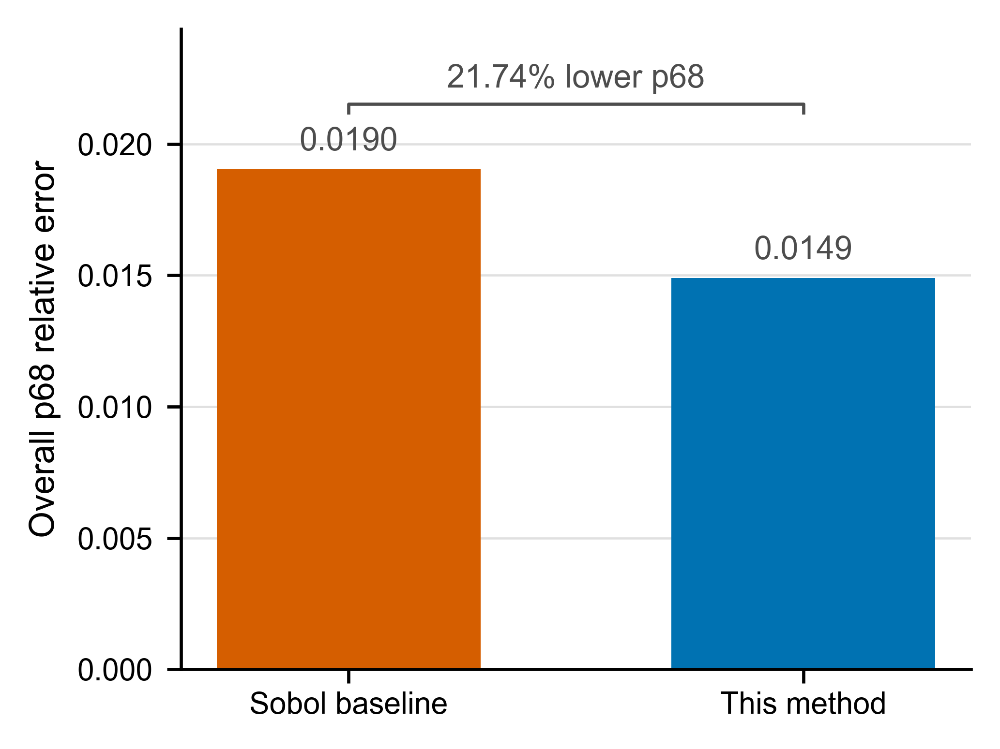
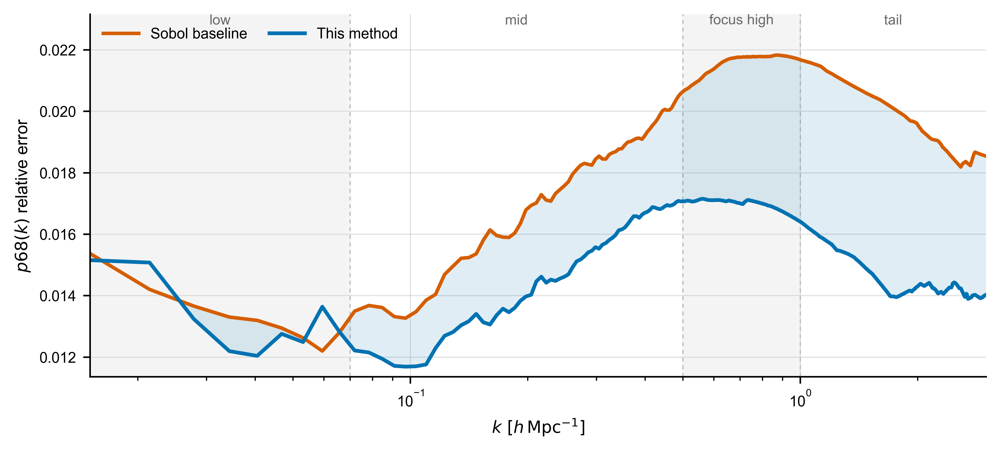
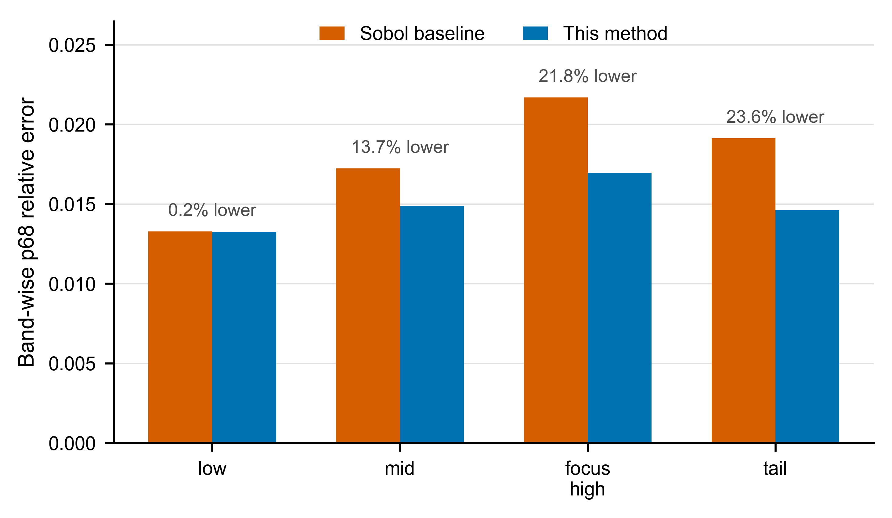
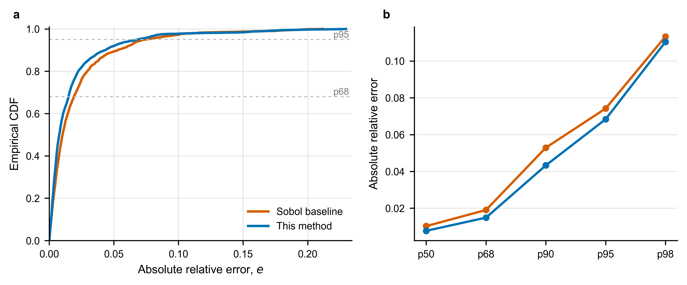
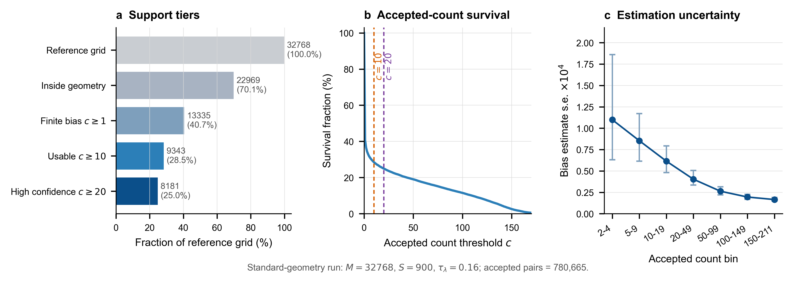
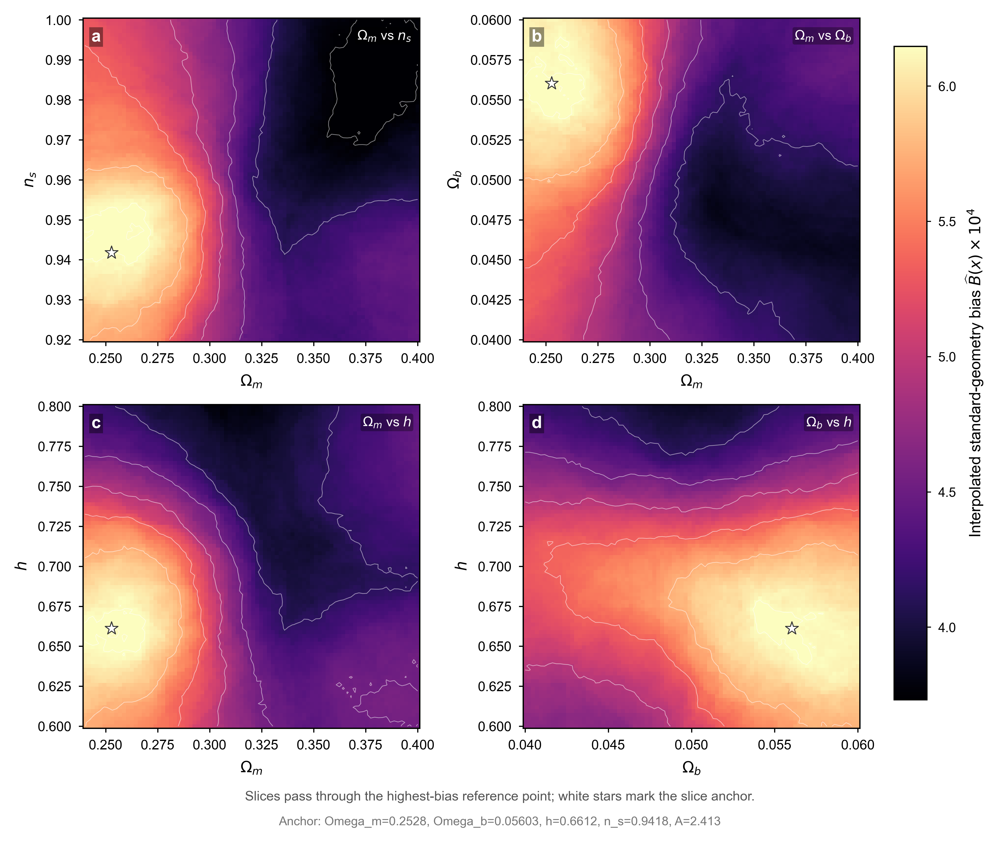

# Training-point design for few-shot Quijote power-spectrum emulators using a standard-geometry bias field and active learning

**Authors:** Author list to be finalized before external submission.  
**Affiliations:** Institutional affiliations and corresponding-author details to be finalized before external submission.  
**Manuscript status:** Internal MNRAS-style review draft, 2 July 2026.

## Abstract

Accurate nonlinear matter-power-spectrum emulators require careful allocation of expensive simulation samples, especially when the high-fidelity budget is small. Conventional space-filling designs provide stable global coverage, whereas variance-driven active learning can miss regions where posterior uncertainty is low but validation bias remains high. We introduce a two-stage training-point design for few-shot Quijote emulation. First, an auxiliary KUN spectrum generator is used only to measure an error-shape proxy under standardized local Delaunay geometry. The resulting standard-geometry bias field is converted into a potential for potential-driven particle relaxation, producing a 32-point cold-start design. Second, the remaining 32 Quijote points are selected sequentially inside node-free simplices by an acquisition score combining Quijote GP posterior variance with the KUN-derived bias proxy. The final emulator is trained and validated entirely on Quijote spectra with the same residual-anchor PCA-GP workflow used for the Sobol baseline. Under a fixed 64-point budget and a fixed 256-point LHS validation set, the method reduces the overall \(p68\) relative error from 0.019040 to 0.014901, a 21.74% reduction in the bulk error distribution. The gains are concentrated at \(k\geq 0.07\,h\,\mathrm{Mpc}^{-1}\), while tail behavior remains a separate limitation. These results show that geometry-normalized error structure can improve training-point allocation without mixing auxiliary spectra into the final Quijote training set.

**Key words:** cosmology: theory -- large-scale structure of Universe -- methods: numerical -- methods: statistical -- methods: data analysis

## 1. Introduction

The nonlinear matter power spectrum \(P_{\mathrm{nl}}(k)\) is a central theoretical quantity in modern cosmological parameter inference (Eisenstein & Hu 1998; Cooray & Sheth 2002). Weak gravitational lensing, galaxy clustering, and future large-scale-structure surveys all require fast and accurate predictions of \(P_{\mathrm{nl}}(k)\) across a broad range of wavenumbers, especially as analyses increasingly use small-scale information. Direct \(N\)-body simulations provide high-fidelity predictions of nonlinear structure growth, but each cosmological parameter point is computationally expensive. Power-spectrum emulators therefore provide a critical link between accurate numerical simulations and large-scale Bayesian parameter inference under finite simulation budgets (Heitmann et al. 2009; Lawrence et al. 2010; Knabenhans et al. 2021; Angulo et al. 2021; Moran et al. 2023).

This task is difficult not only because each simulation is expensive, but also because the power spectrum is a functional output. An emulator must learn a mapping from a multidimensional cosmological parameter space to an entire power-spectrum curve, and the small-sample regime amplifies the effect of training-point placement on final accuracy. Space-filling designs such as Sobol or Latin hypercube sampling (LHS) provide stable global coverage, but they do not directly identify regions that contribute disproportionately to the final error (Sobol' 1967; McKay et al. 1979; Johnson et al. 1990; Morris & Mitchell 1995; Owen 1998). Active learning based on Gaussian-process posterior variance can place samples where the model is uncertain, but posterior variance is not necessarily equivalent to true validation error (MacKay 1992; Cohn et al. 1996; Gramacy & Lee 2009). Thus, relying only on space filling or only on the model's own uncertainty can miss regions that matter for the final error. This mismatch between model uncertainty and true bias motivates our use of an approximate bias signal and a combined acquisition score.

We focus on a constrained setting that is close to realistic simulation budgets: under a fixed high-fidelity Quijote sample budget, the goal is to design training points so that the final emulator improves over a Sobol baseline. The final Quijote emulator is still trained and validated entirely using Quijote data under a unified training and validation protocol (Villaescusa-Navarro et al. 2020).

We propose a two-stage active design framework. The first stage constructs a cold-start design. We build a bias field under standard geometric conditions, convert the geometry dependence embedded in a particular sample distribution into a conditional-estimation problem, and use the resulting bias field to drive potential-based particle relaxation (PPR). This produces an initial training-point distribution that contains both space-coverage information and error-field information. The second stage performs sequential active selection. Within a Delaunay-simplex search framework, we use a score that combines variance and approximate bias, so that point selection is not driven only by GP posterior variance but can also identify high-bias, low-variance regions. The auxiliary spectrum generator KUN is used only as a fast spectrum source and a bias-proxy source during acquisition (Chen et al. 2025; CSST Emulator Documentation 2026). The final Quijote emulator training set and validation truth remain fully defined by the Quijote protocol.

Under the current fixed 64-point Quijote budget and fixed validation protocol, our method uses PPR to construct the first 32 training points and then selects the remaining 32 points by variance-bias active learning. Relative to the Sobol baseline, the method reduces the overall \(p68\) relative error from \(0.0190\) to \(0.0149\), corresponding to an approximately \(21.7\%\) improvement in the main body of the error distribution. This improvement should be interpreted primarily as a reduction in the bulk error distribution measured by \(p68\); extreme-error metrics are discussed separately in the diagnostic results.

The contributions of this paper are threefold. First, we introduce a standard-geometry construction for a bias field, which treats the sample-geometry effect mixed into raw bias through conditioning. Second, we use this bias field for PPR cold-start design, so that the initial sample distribution under a finite budget contains error-field information in addition to space coverage. Third, we introduce a KUN-assisted variance-bias acquisition score into Delaunay-simplex active search, thereby complementing conventional variance-driven selection in high-bias, low-variance regions.

Alt text: Schematic workflow with three paths: Quijote truth for final training and validation, KUN auxiliary spectra for the bias prior, and the design loop producing a 64-point training set.

## 2. Problem setting, training target, and evaluation protocol

All sampling strategies are compared on the same power-spectrum emulator task. The final emulator training and validation conditions are held fixed; the differences lie in the training-point design and in the acquisition information used during selection. We refer to this fixed setup as the unified training and validation protocol. It includes the parameter box, the residual-anchor target, the \(k\)-grid, the PCA-GP training procedure, the validation set, and the primary evaluation metric. We consider the five-dimensional CDM parameter space provided by the Quijote data source and denote the parameter vector by

\[
\theta=(\Omega_m,\Omega_b,h,n_s,A),
\tag{1}
\]

where \(A\) is the power-spectrum amplitude parameter used in this work and is equivalent to the common \(10^9A_s\) notation. The parameter box is

\[
\Omega_m\in[0.24,0.40],\quad
\Omega_b\in[0.04,0.06],\quad
h\in[0.60,0.80],\quad
n_s\in[0.92,1.00],\quad
A\in[1.7,2.5].
\tag{2}
\]

For each parameter point \(\theta\), the target physical quantity is the nonlinear matter power spectrum \(P_{\mathrm{nl}}(\theta,k)\). We use the fixed \(k\)-grid retained in the current Quijote raw bank:

\[
k\in[0.0151,2.994]\,h\,\mathrm{Mpc}^{-1},
\quad N_k=475.
\tag{3}
\]

This range is the actual \(k\)-support recorded in the current training, selection, and validation arrays. All methods use the same \(k\)-bins, and these bins are held fixed across training, selection, and validation. The emulator task is therefore to learn the functional mapping from the five-dimensional parameter space to the power-spectrum curve:

\[
\theta \mapsto P_{\mathrm{nl}}(\theta,k).
\tag{4}
\]

We use a residual-anchor target for emulator training. Specifically, the emulator learns the logarithmic residual of the Quijote CDM nonlinear power spectrum relative to a CAMB CDM nonlinear anchor:

\[
r_Q(\theta,k)
=
\log P^{Q,\mathrm{nl}}(\theta,k)
-
\log P^{\mathrm{CDM,nl}}_{\mathrm{anchor}}(\theta,k).
\tag{5}
\]

This representation assigns the known smooth physical trend to the anchor and leaves the PCA-GP emulator to learn the residual structure between Quijote and the anchor. This is better suited to small-sample training. At prediction time, the emulator outputs \(\widehat r_Q(\theta,k)\), and the power spectrum is recovered as

\[
\log \widehat P^{Q,\mathrm{nl}}(\theta,k)
=
\widehat r_Q(\theta,k)
+
\log P^{\mathrm{CDM,nl}}_{\mathrm{anchor}}(\theta,k).
\tag{6}
\]

The model implementation uses a PCA-GP emulator (Rasmussen & Williams 2006; Higdon et al. 2008; Conti & O'Hagan 2010; Jolliffe & Cadima 2016). For each training design \(D=\{\theta_i\}_{i=1}^{N}\), we first construct the residual spectra \(r_Q(\theta_i,k)\) at the training points, following the computer-experiment emulator framing (Sacks et al. 1989; Santner et al. 2018). We then apply PCA to the training residual spectra and train a Gaussian Process on each leading PCA coefficient. During prediction, the Gaussian Process first predicts the PCA coefficients, the residual spectrum is reconstructed through the PCA basis, and the anchor is added back to recover the power spectrum. The PCA truncation rule, GP kernel, and hyperparameter optimization strategy are fixed across all experiments and are reported consistently in the implementation details.

The auxiliary spectrum generator KUN is used to construct a bias proxy during acquisition. KUN is used only in the acquisition stage. The KUN-GP uses the same point distribution as the currently selected Quijote training set, the same residual-anchor representation, and the same PCA-GP training workflow. At candidate points, the difference between the KUN-GP prediction and the KUN generator output is used to estimate the approximate bias under the current sampling state. The final Quijote emulator training set and validation truth still come entirely from Quijote data.

To place the KUN bias proxy and the Quijote task in the same five-dimensional CDM parameter subspace, we map Quijote parameters \(x\) to the official eight-dimensional KUN parameter representation while fixing the three extra parameters:

\[
w=-1,\qquad w_a=0,\qquad \sum m_\nu=0.
\tag{7}
\]

Thus, in this paper KUN provides only an auxiliary error-shape signal corresponding to the current Quijote training-point distribution. It is not included in the final training set. KUN bias is also computed in the residual/log-ratio representation. If the KUN-GP and the KUN generator use the same anchor, their residual difference directly gives the logarithmic form of the relative spectral error, and the common anchor no longer enters the final bias proxy. This setting reduces the effect of anchor mismatch on acquisition scoring, but it does not interpret the amplitude of KUN error as the pointwise true error of Quijote. Throughout the paper, raw bias denotes \(Y_F(x,D)\) under a given training design \(D\), standard-geometry bias denotes the conditional mean \(B_{\mathrm{SG},F}(x)\), and KUN bias proxy denotes \(B_t(x)\) during active selection.

The validation set consists of \(256\) fixed LHS Quijote parameter points inside the parameter box:

\[
\mathcal{V}=\{\theta_j^{\mathrm{val}}\}_{j=1}^{256}.
\tag{8}
\]

This validation set is unchanged across all methods. For validation point \(\theta_j^{\mathrm{val}}\) and wavenumber \(k_m\), the relative error is defined as

\[
e_{j,m}
=
\frac{
\left|
\widehat P^{Q,\mathrm{nl}}(\theta_j^{\mathrm{val}},k_m)
-
P^{Q,\mathrm{nl}}(\theta_j^{\mathrm{val}},k_m)
\right|
}{
P^{Q,\mathrm{nl}}(\theta_j^{\mathrm{val}},k_m)
}.
\tag{9}
\]

The primary metric is the \(p68\) relative error. For a fixed \(k_m\), it is the \(68\%\) quantile of the validation-set relative errors:

\[
p68(k_m)
=
Q_{0.68}
\left(
e_{1,m},\ldots,e_{256,m}
\right).
\tag{10}
\]

The overall metric is computed by pooling all validation points and all \(k\)-bins:

\[
p68_{\mathrm{overall}}
=
Q_{0.68}
\left(
e_{j,m}
\right).
\,\,
j=1,\ldots,256,\quad m=1,\ldots,475.
\tag{11}
\]

Thus, overall \(p68\) is the \(68\%\) quantile over all relative errors from all validation points and \(k\)-bins. We use \(p68\) as the primary metric because this work focuses on improving the bulk of the error distribution. The \(p68\) notation is kept throughout for this body-error metric, and \(p68\) is the quantity optimized in the main comparison. The \(p50\), \(p90\), and \(p98\) metrics are used as auxiliary diagnostics for different error quantile regimes.

The main comparison is against a Sobol baseline. In the main experiment, the Sobol baseline uses 64 Quijote training points. Our full method uses PPR to construct the first 32 points and then uses the variance-bias active-selection method to choose the remaining 32 points. Both are evaluated under the unified training and validation protocol, so the final comparison reflects the effect of the sample-design strategy itself.

The data, parameter box, training budget, \(k\)-range, validation set, and primary metric are summarized in Table 1.

Table 1 | Experimental setup and evaluation protocol.

| Component | Setting |
|---|---|
| Data source | Quijote CDM nonlinear power spectrum |
| Cosmological parameters | \(\theta=(\Omega_m,\Omega_b,h,n_s,A)\), with \(A=10^9A_s\) |
| Parameter box | \(\Omega_m\in[0.24,0.40]\), \(\Omega_b\in[0.04,0.06]\), \(h\in[0.60,0.80]\), \(n_s\in[0.92,1.00]\), \(A\in[1.7,2.5]\) |
| \(k\)-range | \(k\in[0.0151,2.994]\,h\,\mathrm{Mpc}^{-1}\) |
| \(k\)-bins | \(N_k=475\) fixed bins |
| Training target | \(r_Q(\theta,k)=\log P^{Q,\mathrm{nl}}(\theta,k)-\log P^{\mathrm{CDM,nl}}_{\mathrm{anchor}}(\theta,k)\) |
| Anchor model | CAMB CDM nonlinear anchor |
| Emulator | PCA-GP emulator |
| Validation set | 256 fixed LHS Quijote points |
| Primary metric | Overall \(p68\) relative error |
| Baseline design | Sobol, 64 Quijote points |
| Proposed method | Full method: PPR cold-start design + variance-bias active selection |
| Auxiliary bias source | KUN, used only as a bias proxy during acquisition; the final Quijote emulator training set and validation truth both come from Quijote data |

## 3. Standard-geometry bias field and PPR cold-start design

This section describes the first stage of the proposed method: constructing an early training-point distribution before active selection begins. The goal is to generate a cold-start design that is more targeted than a purely Sobol design, so that the finite Quijote training budget covers regions more likely to produce emulator error from the outset. We first use KUN to construct a bias field under standard geometric conditions, and then convert that field into a PPR potential surface. Particle relaxation on this surface produces the first 32 Quijote training points.

Alt text: Four-panel schematic showing design-dependent raw bias, standard-geometry acceptance, accepted-only averaging, and interpolation into a continuous bias prior.

### 3.1 Design dependence of raw bias

Let the normalized parameter position be

\[
x\in[0,1]^d,
\tag{12}
\]

where \(d=5\). For any training design \(D=\{x_i\}_{i=1}^{N}\), an auxiliary spectrum generator \(F\) can be used to train a PCA-GP with the same structure as the Quijote emulator, and to evaluate prediction error at a candidate location \(x\). In this work, \(F\) is KUN. Let the KUN residual target be \(r_F(x,k)\), and let the prediction trained under design \(D\) be \(\widehat r_{F,D}(x,k)\). Because prediction and truth use the same anchor, the residual difference can be written as a multiplicative power-spectrum error:

\[
\frac{\widehat P_F(x,k;D)}{P_F(x,k)}
=
\exp\left[
\widehat r_{F,D}(x,k)-r_F(x,k)
\right].
\tag{13}
\]

We define the KUN bias proxy at location \(x\) under design \(D\) as

\[
Y_F(x,D)
=
Q_{0.68,k}
\left(
\left|
\exp\left[
\widehat r_{F,D}(x,k)-r_F(x,k)
\right]
-1
\right|
\right),
\tag{14}
\]

where \(Q_{0.68,k}\) denotes the \(68\%\) quantile over all \(k\)-bins. This quantity measures the bulk relative error of the auxiliary PCA-GP on the KUN spectrum under the current training-point distribution.

In this work, the KUN bias proxy acts as a shape proxy for difficult regions. The cold-start PPR uses this field to determine the relative direction in which the sampling density should tilt. The core information is the location, relative ordering, and global shape of high-bias regions. The working assumption is that, under the same five-dimensional parameter box, residual-anchor representation, \(k\)-grid, and PCA-GP workflow, regions with high \(Y_F\) on KUN residuals tend to correspond to more sensitive residual spectral shapes, stronger local curvature or parameter coupling, and structures that are harder to represent using finite PCA truncation and finite-sample PCA-GP. This assumption uses the KUN bias field only as a shape prior for difficult regions. Section 5 tests its practical value through fixed Quijote validation, cold-start comparison, selected-point diagnostics, and mechanism ablations.

Using \(Y_F(x,D)\) directly as a PPR potential would introduce strong geometric dependence. Errors near training points are naturally lower because interpolation constraints are stronger, whereas errors far from training points or near simplex holes are higher. The same location can therefore receive different bias estimates under different training-point distributions. In other words, \(Y_F(x,D)\) contains both location-dependent learning difficulty and the effect of training-point geometry. We write this dependence as

\[
Y_F(x,D)=\mathcal{F}(x,D).
\tag{15}
\]

In the current implementation, no additional measurement noise is injected into \(Y_F\). Given a training design, the KUN generator, and the PCA-GP workflow, the bias observation is mainly deterministic. The practical uncertainty comes from the randomized external designs \(D_s\), the finite number of accepted observations \(c_j\) used to estimate the conditional mean, and numerical optimization and floating-point errors. The central task of this section is to construct a conditional bias field from these design-dependent observations that can be used for cold-start design.

### 3.2 Standard geometric condition

To make bias values at different locations comparable, we do not compare \(Y_F(x,D)\) under arbitrary geometric conditions. Instead, we retain only observations satisfying a standard geometric condition. Let \(D\) generate a Delaunay triangulation in the normalized parameter space (Aurenhammer 1991; Barber et al. 1996). For a reference point \(x\), if it lies inside a valid simplex \(\Delta(x,D)\), then that simplex has \(d+1\) vertices:

\[
\Delta(x,D)=\{v_1,\ldots,v_{d+1}\}.
\tag{16}
\]

The barycentric coordinates of \(x\) in this simplex are denoted by

\[
\lambda(x;\Delta)
=
(\lambda_1,\ldots,\lambda_{d+1}),
\qquad
\sum_{\ell=1}^{d+1}\lambda_\ell=1.
\tag{17}
\]

The barycentric coordinates of the simplex center are

\[
\lambda_0
=
\left(
\frac{1}{d+1},\ldots,\frac{1}{d+1}
\right).
\tag{18}
\]

We first use

\[
\delta_\lambda(x,D)
=
\max_{\ell}
\left|
\lambda_\ell(x;\Delta)-\frac{1}{d+1}
\right|
\tag{19}
\]

to measure whether \(x\) is near the center of the simplex. The center condition alone is not sufficient to standardize geometry, because extremely small simplices, highly elongated simplices, and simplices near the parameter-box boundary can all lead to unstable bias observations. Therefore, the standard geometric condition also includes constraints on simplex scale, shape, and boundary distance.

Let the simplex center be

\[
\bar v
=
\frac{1}{d+1}
\sum_{\ell=1}^{d+1}v_\ell,
\tag{20}
\]

and define the scale as

\[
h(\Delta)
=
\left[
\frac{1}{d+1}
\sum_{\ell=1}^{d+1}
\lVert v_\ell-\bar v\rVert^2
\right]^{1/2}.
\tag{21}
\]

The simplex shape is measured by the condition number of the edge matrix:

\[
\kappa(\Delta)
=
\operatorname{cond}
\left(
[v_2-v_1,\ldots,v_{d+1}-v_1]
\right).
\tag{22}
\]

The boundary distance is

\[
b(x)
=
\min_{q=1,\ldots,d}
\min(x_q,1-x_q).
\tag{23}
\]

Let \(\tau_\lambda\), \(h_{\min}\), \(h_{\max}\), \(\kappa_{\max}\), and \(b_{\min}\) denote the center target region, lower scale threshold, upper scale threshold, shape threshold, and boundary-distance threshold, respectively. The standard-geometry acceptance indicator is determined by five conditions. The first is the valid-simplex condition \(G_\Delta(x,D)\), meaning that \(x\) lies inside a valid Delaunay simplex of \(D\). The other four conditions are

\[
G_\lambda(x,D):
\quad
\delta_\lambda(x,D)\leq\tau_\lambda,
\tag{24}
\]

\[
G_h(x,D):
\quad
h_{\min}\leq h(\Delta)\leq h_{\max},
\tag{25}
\]

\[
G_\kappa(x,D):
\quad
\kappa(\Delta)\leq \kappa_{\max},
\tag{26}
\]

\[
G_b(x):
\quad
b(x)\geq b_{\min}.
\tag{27}
\]

The standard-geometry acceptance indicator is then

\[
A_{\mathrm{SG}}(x,D)
=
\mathbf{1}
\left[
G_\Delta(x,D)
\land
G_\lambda(x,D)
\land
G_h(x,D)
\land
G_\kappa(x,D)
\land
G_b(x)
\right].
\tag{28}
\]

In the current implementation,

\[
\tau_\lambda=0.16,
\qquad
b_{\min}=0.02.
\tag{29}
\]

The scale thresholds \(h_{\min}\) and \(h_{\max}\) are estimated from the distribution of valid-simplex scales formed by \(S\) external randomized space-filling designs, using the \(10\%\) and \(90\%\) quantiles. The threshold \(\kappa_{\max}\) is set to the \(90\%\) quantile of the valid-simplex condition-number distribution from the same set of designs. This keeps representative local geometries while removing observations from very small, very large, degenerate, or strongly boundary-affected simplices.

### 3.3 Conditional definition of the standard-geometry bias field

Let \(\Pi_N\) be a distribution over designs, where each \(D\sim\Pi_N\) is a randomized space-filling design containing \(N\) points. In practice, \(\Pi_N\) may be generated by LHS, scrambled Sobol, or a mixed low-discrepancy sampler. When Sobol-type low-discrepancy sequences are used, the randomness comes from scrambling and independent random seeds (Sobol' 1967; Owen 1998). The expectations and conditional unbiasedness statements below are with respect to this randomized design mechanism and apply to conditional-mean estimation at discrete reference points. The standard-geometry bias field is defined as the conditional mean

\[
B_{\mathrm{SG},F}(x)
=
\mathbb{E}_{D\sim\Pi_N}
\left[
Y_F(x,D)
\mid
A_{\mathrm{SG}}(x,D)=1
\right].
\tag{30}
\]

This quantity has a clear interpretation: when \(x\) is in a typical local simplex with controlled scale, controlled shape, and no severe boundary degeneration, it is the average bulk error of the KUN residual emulator at that location. The standard-geometry average restricts the training-point geometry to a common class of local environments and uses the conditional mean to describe how the learning difficulty of the residual spectrum varies with \(x\). If a region maintains high \(Y_F\) across many external training designs whenever it falls into a similar local geometry, then that region is more likely difficult because of spectral complexity, nonlinear response, and parameter coupling, rather than because of a hole accidentally left by one training-point distribution.

The engineering estimate starts from a fixed reference bank. Let

\[
R=\{x_j\}_{j=1}^{M}
\tag{31}
\]

be a set of reference points covering the parameter box. We independently generate \(S\) randomized space-filling designs,

\[
D_1,\ldots,D_S\sim\Pi_N,
\tag{32}
\]

and compute the acceptance indicator for each \((x_j,D_s)\):

\[
A_{js}
=
A_{\mathrm{SG}}(x_j,D_s).
\tag{33}
\]

If the reference point is accepted under the \(s\)-th design, we compute the corresponding bias observation

\[
Y_{js}
=
Y_F(x_j,D_s).
\tag{34}
\]

The standard-geometry bias estimate at the \(j\)-th reference point is

\[
\widehat B_j
=
\frac{
\sum_{s=1}^{S}A_{js}Y_{js}
}{
\sum_{s=1}^{S}A_{js}
},
\qquad
c_j
=
\sum_{s=1}^{S}A_{js}.
\tag{35}
\]

Here \(c_j\) is the number of accepted observations for reference point \(x_j\). For positions with \(c_j>0\), \(\widehat B_j\) is a conditional sample mean. When the \(D_s\) are independently drawn from the specified design mechanism, the target being estimated is precisely \(B_{\mathrm{SG},F}(x_j)\). The quality of the finite-sample estimate is controlled by \(c_j\): the larger the number of accepted observations, the more stable the conditional mean estimate.

The conditional unbiasedness of this discrete support-point estimator follows directly from conditional sampling. Fix a reference point \(x_j\), and simplify notation by writing

\[
A_s=A_{\mathrm{SG}}(x_j,D_s),
\qquad
Y_s=Y_F(x_j,D_s),
\qquad
n_j=\sum_{s=1}^{S}A_s.
\tag{36}
\]

The target quantity under standard geometry is

\[
B_j
=
B_{\mathrm{SG},F}(x_j)
=
\mathbb{E}
\left[
Y_s\mid A_s=1
\right].
\tag{37}
\]

Conditioned on \(n_j=n\geq1\), the \(n\) accepted observations are equivalent to samples from the conditional distribution \(Y_s\mid A_s=1\). Hence

\[
\mathbb{E}
\left[
\widehat B_j
\mid
n_j=n
\right]
=
\frac{1}{n}
\sum_{a=1}^{n}
\mathbb{E}
\left[
Y_a\mid A_a=1
\right]
=
B_j.
\tag{38}
\]

Taking expectation over all cases with \(n_j>0\) gives

\[
\mathbb{E}
\left[
\widehat B_j
\mid
n_j>0
\right]
=
B_j.
\tag{39}
\]

Thus, conditional on the reference point being accepted at least once, \(\widehat B_j\) is a conditionally unbiased estimator of the standard-geometry conditional mean \(B_{\mathrm{SG},F}(x_j)\) at the discrete location \(x_j\). Moreover, if the acceptance probability \(p_j=\mathbb{P}(A_s=1)>0\), then

\[
\widehat B_j
=
\frac{
S^{-1}\sum_{s=1}^{S}A_sY_s
}{
S^{-1}\sum_{s=1}^{S}A_s
}
\xrightarrow[S\to\infty]{a.s.}
\frac{
\mathbb{E}[A_sY_s]
}{
\mathbb{E}[A_s]
}
=
\mathbb{E}
\left[
Y_s\mid A_s=1
\right]
=
B_j.
\tag{40}
\]

The discrete support-point estimator is therefore also consistent. This is the only unbiasedness statement made in this paper: the accepted-only Monte Carlo estimator \(\widehat B_j\) is conditionally unbiased for \(B_{\mathrm{SG},F}(x_j)\) at the discrete reference point \(x_j\), given the specified randomized design generator \(\Pi_N\) and the event \(A_{\mathrm{SG}}(x_j,D)=1\). When \(\tau_\lambda\) defines a finite centre target region, the target is the conditional average over that finite standard-geometry event.

The continuous field \(\widehat B(x)\) used by PPR is a reliability-weighted interpolation of the discrete support estimates. Interpolation adds smoothing, boundary, and sparse-support approximation error, so no unbiasedness claim is made for \(\widehat B(x)\) at arbitrary continuous locations. The target \(B_{\mathrm{SG},F}(x)\) is also a KUN conditional bias prior under standard local geometry, not an intrinsic Quijote error field and not a pointwise estimate of the final Quijote emulator error. Its role is to provide a geometry-normalized shape prior for cold-start sample allocation. The scientific claim tested in this paper is that using this conditional prior improves the Quijote emulator under the fixed validation protocol.

The standard-geometry bias field used for PPR adopts

\[
M=32768,\quad N=64,\quad S=900,\quad \tau_\lambda=0.16.
\tag{41}
\]

Here \(N=64\) is the local training-design size used to construct the standard-geometry bias field. It corresponds to the few-shot regime of the final fixed budget and defines regional learning difficulty under a 64-point small-sample geometry. The PPR cold start itself outputs only the first 32 training points; active selection then adds the remaining 32 points. Thus, \(N=64\) is the standard-geometry budget used in bias-field measurement, whereas the 32-point \(D_{\mathrm{PPR}}\) is the early design output driven by this field. Both serve the same final 64-point training budget.

Under this configuration, there are \(780665\) accepted observation pairs. Approximately \(40.70\%\) of reference points have finite bias, \(28.51\%\) satisfy \(c_j\geq10\) and are usable support points, and \(24.97\%\) satisfy \(c_j\geq20\) and are high-confidence support points. These statistics show that the standard-geometry bias field is represented by a discrete support set with heterogeneous acceptance counts and reliability weights.

### 3.4 From discrete support to a continuous bias field

PPR requires a potential defined over the continuous parameter space, so the discrete estimates \(\widehat B_j\) must be interpolated into a continuous field. Let the support set measured under standard geometry be

\[
\mathcal{S}_B
=
\{(x_j,\widehat B_j,c_j)\}_{j=1}^{M}.
\tag{42}
\]

We first retain support points satisfying

\[
c_j\geq c_{\min}
\tag{43}
\]

and finite \(\widehat B_j\). In the current implementation, \(c_{\min}=10\), and the high-confidence acceptance threshold is \(c_{\mathrm{high}}=20\). For any query position \(x\), let \(\mathcal{N}_K(x)\) be its \(K\) nearest support points. The continuous bias field is obtained by reliability-weighted local interpolation (Shepard 1968):

\[
\widehat B(x)
=
\frac{
\sum_{j\in\mathcal{N}_K(x)}
w_j(x)\widehat B_j
}{
\sum_{j\in\mathcal{N}_K(x)}
w_j(x)
}.
\tag{44}
\]

The weights are

\[
w_j(x)
=
\rho(c_j)
\exp
\left[
-\frac{1}{2}
\left(
\frac{\lVert x-x_j\rVert}{h_x}
\right)^2
\right],
\tag{45}
\]

where

\[
\rho(c_j)
=
\min
\left(
1,\frac{c_j}{c_{\mathrm{high}}}
\right).
\tag{46}
\]

The bandwidth \(h_x\) is set adaptively from local nearest-neighbor distances around the query point. Thus, nearby support points with higher acceptance counts receive larger weights. Low-count support points can still provide local information, but they do not dominate the interpolation. If a query location has too few high-confidence support points nearby, the nearest-neighbor range is expanded for fallback interpolation. This mechanism provides a continuous bias potential over the full parameter box while retaining the reliability differences among support points.

### 3.5 From bias field to the PPR potential surface

After obtaining the continuous bias field \(\widehat B(x)\), PPR formulates cold-start design as a sample-distribution construction problem. We convert the bias field into a potential surface that increases particle density in high-bias regions while preserving space coverage through repulsion and boundary regularization.

We first normalize the bias field. Let \(B_0\) be a baseline level and \(s_B\) a scale factor:

\[
q_B(x)
=
\left[
\frac{\widehat B(x)-B_0}{s_B}
\right]_+,
\tag{47}
\]

where \([\cdot]_+\) denotes truncation to the non-negative part. The bias potential is then

\[
V_B(x)
=
-g_B\,T(q_B(x)).
\tag{48}
\]

The parameter \(g_B\) controls the strength of the bias potential, and \(T(\cdot)\) is a monotone transform that adjusts the attraction profile of high-bias regions, for example through a power transform, soft cap, or quantile-weighted body transform. The negative sign means that high-bias regions correspond to lower potential, so particles move toward them during relaxation.

In the experiments, \(B_0\), \(s_B\), \(T(\cdot)\), \(g_B\), and the repulsion and boundary parameters used in the particle dynamics are fixed after PPR tuning and before the final cold-start design is generated. The main text gives the method form; the concrete hyperparameter values and configuration paths are reported in the experimental setup or appendix to ensure that the PPR potential is fixed before final evaluation.

### 3.6 PPR particle relaxation

Let the PPR particle positions be

\[
X=\{x_i\}_{i=1}^{N_{\mathrm{PPR}}},
\qquad
x_i\in[0,1]^d.
\tag{49}
\]

Each particle is subject to three forces: a bias-potential force, an inter-particle repulsion force, and a boundary regularization force. The total force on particle \(i\) is

\[
F_i
=
F_i^{\mathrm{bias}}
+
F_i^{\mathrm{rep}}
+
F_i^{\mathrm{bd}}.
\tag{50}
\]

The bias force is the negative gradient of the potential:

\[
F_i^{\mathrm{bias}}
=
-\nabla V_B(x_i).
\tag{51}
\]

It moves particles toward high standard-geometry bias regions. Inter-particle repulsion prevents samples from collapsing into a few high-bias regions. A typical form is

\[
F_i^{\mathrm{rep}}
=
\eta_r
\sum_{j\neq i}
\frac{
\exp(-d_{ij}^2/2\ell_r^2)
}{
d_{ij}^2+\delta^2
}
(x_i-x_j),
\tag{52}
\]

where \(d_{ij}=\lVert x_i-x_j\rVert\), \(\ell_r\) is the repulsion length scale, \(\delta\) is a softening term, and \(\eta_r\) controls the repulsion strength. The boundary force \(F_i^{\mathrm{bd}}\) pushes particles that move too close to the parameter-box boundary back inward, thereby preventing abnormal boundary clustering in the cold-start design.

Particle positions are updated by discrete dynamics:

\[
x_i^{(t+1)}
=
\Pi_{[0,1]^d}
\left[
x_i^{(t)}
+
\eta_t F_i^{(t)}
\right],
\tag{53}
\]

where \(\eta_t\) is the step size and \(\Pi_{[0,1]^d}\) denotes projection back into the parameter box. The relaxation starts from a space-filling initial condition and outputs a stable particle distribution after several iterations. PPR can be interpreted as bias-weighted space filling: it increases sampling density in difficult regions while maintaining global coverage through repulsion, in the same broad geometric-design spirit as centroidal Voronoi tessellation methods (Du et al. 1999).

### 3.7 Cold-start design output and boundaries

In the main experiment, PPR outputs

\[
D_{\mathrm{PPR}}
=
\{x_i^\star\}_{i=1}^{32},
\tag{54}
\]

which is mapped back to the original cosmological parameter box and used as the first 32 training points of the final Quijote emulator. The second-stage active selection then adds training points on top of \(D_{\mathrm{PPR}}\). This section does not define the round-by-round selection rule for the remaining 32 points.

Alt text: PPR schematic showing a bias-field potential surface, particle trajectories, repulsion, boundary regularization, and the final cold-start points.

This stage outputs four objects: the standard-geometry bias support set \(\mathcal{S}_B\), the continuous bias field \(\widehat B(x)\), the PPR potential surface \(V_B(x)\), and the cold-start design \(D_{\mathrm{PPR}}\). Together, these objects transform an auxiliary bias proxy into a Quijote cold-start sample distribution. The next stage retrains the Quijote PCA-GP on the current training set and constructs a round-by-round acquisition score using GP posterior variance and KUN approximate bias.

### 3.8 Experimental support for the cold-start design

Whether this construction improves cold-start design must be tested independently under the fixed Quijote validation protocol. The comparison uses the unified training and validation protocol defined in Section 2. The current standard-geometry bias field uses \(M=32768\), \(N=64\), \(S=900\), and \(\tau_\lambda=0.16\), yielding \(780665\) accepted observation pairs and \(13335\) reference support points with finite bias. These support points are conditional averages of standard-geometry observations from multiple external randomized space-filling designs.

In an independent 32-point cold-start ablation, we evaluate PPR32 and Sobol32 using the fixed 256-point LHS Quijote validation set defined in Section 2. Sobol32 gives an overall \(p68\) of \(0.022609\), whereas the 32-point PPR design gives \(0.021251\). The improvement is approximately

\[
\frac{0.022609-0.021251}{0.022609}
\approx
6.01\%.
\tag{55}
\]

This result shows that, under the same 256-point validation criterion, the standard-geometry bias field improves the early sample distribution before active selection begins. The first 32 training points retain space coverage while increasing sampling density in difficult regions. This section addresses only the cold-start effect of PPR itself; the additional gain from the active selection stage in the full 64-point workflow is reported later.

## 4. Active selection using a variance-bias acquisition score

The previous section defined the cold-start design for the first 32 Quijote training points. This section defines the second stage: sequentially selecting additional Quijote parameter points given the current training set (MacKay 1992; Cohn et al. 1996; Gramacy & Lee 2009). The core idea is to evaluate both the posterior variance of the current Quijote Gaussian Process and the approximate bias provided by KUN, and to search for the highest combined risk within node-free regions defined by Delaunay simplices. This preserves the exploratory ability of variance-driven methods while adding the ability to identify high-bias, low-variance regions.

Alt text: Active-selection schematic combining Quijote GP variance and KUN bias proxy into a score optimized inside Delaunay simplex interiors.

### 4.1 Sequential active-selection setting

The PPR cold-start output is

\[
D_{\mathrm{PPR}}
=
\{x_i^\star\}_{i=1}^{32},
\qquad
x_i^\star\in[0,1]^d.
\tag{56}
\]

Active selection starts from

\[
D_0=D_{\mathrm{PPR}}
\tag{57}
\]

At round \(t\), the current training set is

\[
D_t
=
\{x_i\}_{i=1}^{32+t},
\qquad
t=0,\ldots,31.
\tag{58}
\]

At each round, the current Quijote PCA-GP emulator is retrained, and one new Quijote parameter point \(x_{t+1}\) is selected. The training set is updated as

\[
D_{t+1}
=
D_t\cup\{x_{t+1}\}.
\tag{59}
\]

The output of the active-selection stage is

\[
D_{\mathrm{AL}}
=
\{x_{33},\ldots,x_{64}\},
\tag{60}
\]

and the final training set is

\[
D_{\mathrm{final}}
=
D_{\mathrm{PPR}}
\cup
D_{\mathrm{AL}}.
\tag{61}
\]

This section defines the rule for selecting \(x_{t+1}\). Once the new point is selected, its Quijote power-spectrum truth is queried and added to the training set for the next Quijote PCA-GP training round.

### 4.2 Delaunay simplices and node-free subspaces

Given the deduplicated current training set \(D_t\), we construct a Delaunay triangulation in the normalized parameter space:

\[
\mathcal{T}(D_t)
=
\{\Delta_m\}_{m=1}^{M_t}.
\tag{62}
\]

Strictly, \(\mathcal{T}(D_t)\) covers the convex hull \(\operatorname{conv}(D_t)\). Since \(D_t\subset[0,1]^d\), the convex hull is also inside the parameter box. The active search domain is therefore

\[
\Omega_t
=
\bigcup_{\Delta_m\in\mathcal{T}(D_t)}
\operatorname{int}(\Delta_m)
\subseteq
\operatorname{conv}(D_t)
\subseteq
[0,1]^d.
\tag{63}
\]

The node-free property below applies to valid simplices in \(\Omega_t\); regions outside the convex hull are not used for within-simplex maximization in this round.

Each \(d\)-simplex \(\Delta_m\) has \(d+1\) current training points as vertices:

\[
\Delta_m
=
\operatorname{conv}
\left(
v_{m,1},\ldots,v_{m,d+1}
\right),
\qquad
v_{m,\ell}\in D_t.
\tag{64}
\]

Its interior can be represented using barycentric coordinates:

\[
\operatorname{int}(\Delta_m)
=
\left\{
x=
\sum_{\ell=1}^{d+1}
\lambda_\ell v_{m,\ell}
\ \middle|\
\lambda_\ell>0,\ 
\sum_{\ell=1}^{d+1}\lambda_\ell=1
\right\}.
\tag{65}
\]

Here, node-free means that the simplex interior contains no current training node. First, a vertex \(v_{m,\ell}\) of the simplex has barycentric coordinates with component \(\ell\) equal to \(1\) and all other components equal to \(0\), so it is not in \(\operatorname{int}(\Delta_m)\). Second, after deduplication and under a general-position condition, the Delaunay triangulation forms a simplicial complex with vertex set \(D_t\). The intersection of any two simplices can only be a shared face. If another training point \(z\in D_t\) lay inside \(\operatorname{int}(\Delta_m)\), then the zero-dimensional simplex \(\{z\}\) would intersect the interior of \(\Delta_m\), but that intersection would not be a shared face, contradicting the simplicial-complex intersection condition. Therefore,

\[
\operatorname{int}(\Delta_m)
\cap
D_t
=
\varnothing.
\tag{66}
\]

Each simplex interior is therefore a local search region enclosed by current training points but containing no training node. Active selection over

\[
\bigcup_{m=1}^{M_t}
\operatorname{int}(\Delta_m)
\tag{67}
\]

avoids locations near existing interpolation nodes. Since GP posterior variance and the KUN bias proxy are usually lower near training points, searching inside simplex interiors pushes candidates toward regions that are not yet sufficiently constrained by the current design.

### 4.3 Quijote GP posterior-variance risk score

At round \(t\), the Quijote residual-anchor target for the current training set \(D_t\) is \(r_Q(x,k)\). The trained PCA-GP gives a posterior variance for each PCA coefficient. Let the posterior variance of coefficient \(q\) at candidate point \(x\) be

\[
\sigma_{t,q}^2(x).
\tag{68}
\]

To convert variance in PCA-coefficient space into a spectral-space risk associated with \(k\)-bands, we use the energy fraction of the PCA basis functions in different \(k\)-bands as projection weights. Let \(\phi_q(k)\) be the \(q\)-th PCA basis function and let \(\mathcal{K}_b\) be the \(b\)-th \(k\)-band. Define

\[
\gamma_{q,b}
=
\frac{
\int_{\mathcal{K}_b}
\phi_q^2(k)\,d\log k
}{
\sum_{b'}
\int_{\mathcal{K}_{b'}}
\phi_q^2(k)\,d\log k
}.
\tag{69}
\]

The posterior-variance risk score in \(k\)-band \(b\) is

\[
U_{t,b}(x)
=
\sum_q
\gamma_{q,b}
\sigma_{t,q}^2(x).
\tag{70}
\]

With band weights \(\boldsymbol{\alpha}^{(V)}\), the weighted posterior-variance risk score at the candidate point is

\[
U_t(x)
=
\sum_b
\alpha_b^{(V)}
U_{t,b}(x).
\tag{71}
\]

In the current configuration, the variance weights are

\[
\boldsymbol{\alpha}^{(V)}
=
(0.30,\ 1.35,\ 1.30,\ 1.05),
\tag{72}
\]

corresponding to the low, mid, focus high, and tail \(k\)-bands. These weights make active selection pay more attention to the mid-to-high \(k\) regions where the main error is concentrated, while retaining constraints from the low-\(k\) and tail regions.

### 4.4 KUN approximate bias term

The posterior-variance risk score reflects the model uncertainty of the current Quijote GP. To additionally identify high-bias, low-variance regions, we construct a KUN approximate bias term in the same round. The KUN PCA-GP uses exactly the same training-point distribution \(D_t\) and the same training workflow as Quijote. For any candidate point \(x\), the KUN oracle maps the five-dimensional Quijote parameters to the official eight-dimensional KUN representation while fixing \(w=-1\), \(w_a=0\), and \(\sum m_\nu=0\). Let the residual target from the KUN oracle be

\[
r_F(x,k)
=
\log P_F^{\mathrm{nl}}(x,k)
-
\log P_{F,\mathrm{anchor}}^{\mathrm{nl}}(x,k),
\tag{73}
\]

where \(P_{F,\mathrm{anchor}}^{\mathrm{nl}}\) is the CDM nonlinear anchor used by the official KUN workflow. The KUN PCA-GP trained on \(D_t\) gives \(\widehat r_{F,D_t}(x,k)\). The relative-error proxy at each \(k\)-bin is

\[
e_{F,t}(x,k)
=
\left|
\exp
\left[
\widehat r_{F,D_t}(x,k)
-
r_F(x,k)
\right]
-1
\right|.
\tag{74}
\]

This compares residual prediction and residual truth under the same KUN anchor, so the common anchor cancels in the residual difference. Equivalently, \(e_{F,t}(x,k)\) measures the relative spectral error of the KUN-GP with respect to the KUN generator under the current training-point distribution. It does not measure the difference between raw KUN spectra and raw Quijote spectra. This definition makes \(B_t(x)\) a bias-shape proxy under the same training workflow and avoids directly inserting absolute KUN-Quijote spectral differences into the acquisition score.

We aggregate \(B_t(x)\) using the mean relative error with smooth weights along \(\log k\). Let \(k_m\) be the \(m\)-th \(k\)-bin, and let \(\Delta_m^{\log k}\) be the corresponding trapezoidal integration weight in \(\log k\). The four \(k\)-bands are

\[
[0.0151,0.07),\quad
[0.07,0.5),\quad
[0.5,1.0),\quad
[1.0,2.994],
\tag{75}
\]

with weights \(\boldsymbol{\alpha}^{(B)}=(\alpha_1^{(B)},\ldots,\alpha_4^{(B)})\). To avoid discontinuities at band boundaries, adjacent weights are connected with a \(\tanh\) smooth step. Let \(\ell=\log_{10}k\), the boundaries be \(\kappa_1=0.07\), \(\kappa_2=0.5\), and \(\kappa_3=1.0\), and the transition width be \(\delta_\ell=0.10\). Define

\[
H_b(k)
=
\frac{1}{2}
\left[
1+
\tanh
\left(
\frac{\log_{10}k-\log_{10}\kappa_b}{\delta_\ell}
\right)
\right],
\qquad b=1,2,3.
\tag{76}
\]

Starting from \(\widetilde W_1(k)=\alpha_1^{(B)}\), use the recursion

\[
\widetilde W_{b+1}(k)
=
\left[1-H_b(k)\right]\widetilde W_b(k)
+
H_b(k)\alpha_{b+1}^{(B)},
\qquad b=1,2,3.
\tag{77}
\]

Let \(\widetilde W_B(k)=\widetilde W_4(k)\), and normalize it by the \(\log k\)-averaged weight:

\[
\bar W_B
=
\frac{
\sum_{m=1}^{M_k}
\Delta_m^{\log k}
\widetilde W_B(k_m)
}{
\sum_{m=1}^{M_k}
\Delta_m^{\log k}
},
\qquad
W_B(k_m;\boldsymbol{\alpha}^{(B)})
=
\frac{\widetilde W_B(k_m)}{\bar W_B}.
\tag{78}
\]

The discrete weights used to aggregate \(B_t(x)\) are then

\[
\tilde{\omega}_m^{(B)}
=
\Delta_m^{\log k}
W_B(k_m;\boldsymbol{\alpha}^{(B)}),
\qquad
\omega_m^{(B)}
=
\frac{
\tilde{\omega}_m^{(B)}
}{
\sum_{m'=1}^{M_k}
\tilde{\omega}_{m'}^{(B)}
}.
\tag{79}
\]

The KUN approximate bias score is

\[
B_t(x)
=
\sum_{m=1}^{M_k}
\omega_m^{(B)}
e_{F,t}(x,k_m).
\tag{80}
\]

The default configuration is

\[
\boldsymbol{\alpha}^{(B)}
=
(0.40,\ 1.25,\ 1.35,\ 1.25).
\tag{81}
\]

This weighting strengthens the bias contribution over \(k\in[0.07,2.994]\,h\,\mathrm{Mpc}^{-1}\), especially in the mid and focus-high regions. This is the \(k\)-weighted mean relative-error statistic used in this paper. KUN provides only a bias-shape proxy under the current training-point distribution. Because it uses the same five-dimensional parameter positions, residual-anchor representation, and PCA-GP workflow as Quijote, it provides a complementary signal for difficult regions during active selection.

The normalized profile \(W_B(k)\) is therefore the final \(k\)-dependent bias-weighting curve used to aggregate the KUN proxy at each round conditioned on \(D_t\).

### 4.5 Variance-bias acquisition score

The posterior-variance risk \(U_t(x)\) and the bias score \(B_t(x)\) have different units and numerical scales, so they must be normalized before being combined. Let \(\mathcal{R}_t\) be the probe points used for normalization at round \(t\). We use the same quantile statistic to define the two scale factors:

\[
s_{U,t}
=
Q_{0.68}
\left(
\{U_t(z):z\in\mathcal{R}_t\}
\right),
\tag{82}
\]

\[
s_{B,t}
=
Q_{0.68}
\left(
\{B_t(z):z\in\mathcal{R}_t\}
\right).
\tag{83}
\]

The normalized acquisition score is

\[
S_t(x)
=
\left[
\left(
\frac{U_t(x)}{s_{U,t}}
\right)^2
+
\left(
\lambda
\frac{B_t(x)}{s_{B,t}}
\right)^2
\right]^{1/2}.
\tag{84}
\]

Here \(\lambda\) controls the overall strength of the bias term. The current default is

\[
\lambda=1.1.
\tag{85}
\]

The formula can be understood through two types of candidates. If the Quijote GP posterior variance is high in a region, \(U_t(x)\) increases the combined score and encourages continued exploration of currently uncertain regions. If posterior variance is not high but the KUN-GP has high prediction error under the same training-point distribution, \(B_t(x)\) increases the score and brings that region into the active-selection search. The score therefore describes candidate learning risk under the current training state.

Both \(U_t(x)\) and \(B_t(x)\) are risk proxies for point selection. The former comes from the posterior-variance structure of the current Quijote GP, and the latter comes from the prediction-error shape of KUN under the same training-point distribution. Thus, \(S_t(x)\) is used only for ranking candidates and locating potentially difficult regions; its numerical value is not the true final Quijote emulator error at that point.

### 4.6 Continuous maximization inside simplex interiors

At round \(t\), each Delaunay simplex \(\Delta_m\) defines a node-free search region. We seek the local maximum of the acquisition score inside that simplex:

\[
S_{t,m}^{\star}
=
\max_{x\in \operatorname{int}(\Delta_m)}
S_t(x).
\tag{86}
\]

The corresponding best point inside the simplex is

\[
x_{t,m}^{\star}
=
\arg\max_{x\in \operatorname{int}(\Delta_m)}
S_t(x).
\tag{87}
\]

The next global point is selected from all simplex-wise optima:

\[
x_{t+1}
=
x_{t,m^\star}^{\star},
\qquad
m^\star
=
\arg\max_m
S_{t,m}^{\star}.
\tag{88}
\]

Since only one Quijote point is added in each round, this rule directly implements the single-point active-learning strategy. After \(x_{t+1}\) is selected, the system queries the Quijote truth, obtains the nonlinear power spectrum at that point, and adds it to the next training set.

### 4.7 Staged approximate optimization

The previous subsection defines a continuous maximization problem. The numerical implementation uses standard scientific Python components for QMC sampling, Delaunay geometry, interpolation, optimization, PCA, and Gaussian-process regression (Pedregosa et al. 2011; Harris et al. 2020; Virtanen et al. 2020). In practice, high-accuracy continuous optimization over every simplex would become expensive as the number of simplices and candidate evaluations grows. We therefore use a staged approximation. The objective is always \(S_t(x)\), but the implementation first uses inexpensive candidate evaluations to remove low-risk simplices, then concentrates computation on a small number of high-scoring simplex interiors. This preserves the continuous-search objective while controlling the cost of each active-selection round.

The implementation has three levels. First, representative points and a small number of internal probe points are evaluated in each simplex to obtain an initial ranking. Let the stage-0 retention fraction be \(\rho_0\), or equivalently use a top-\(K_0\) rule to retain high-scoring simplices. Internal probe points are generated in barycentric coordinates, for example

\[
x_{m,q}
=
\sum_{\ell=1}^{d+1}
\lambda_{q,\ell}
v_{m,\ell},
\qquad
\lambda_{q,\ell}\geq0,\quad
\sum_{\ell=1}^{d+1}\lambda_{q,\ell}=1.
\tag{89}
\]

These points cover the simplex interior and provide a low-cost estimate of whether the simplex is worth further search. Second, within retained high-scoring simplices, \(Q\) quasi-Monte Carlo candidates are generated in barycentric-coordinate space and \(S_t(x)\) is evaluated in batch. This gives a more stable estimate of the within-simplex maximum. Finally, local continuous optimization is applied to a small number of top-ranked simplices. Let the final polish retention fraction be \(\rho_p\), and let \(R_p\) be the number of initialization points per retained simplex. This step only improves the positional accuracy of the final candidate point.

High-scoring points from all stages are merged and re-evaluated, and the highest-scoring point is selected for the round. The quantities \(\rho_0\), \(Q\), \(\rho_p\), and \(R_p\) are implementation hyperparameters for approximate optimization and are reported consistently in the experimental setup. The staged structure does not change the definition of \(S_t(x)\); it only affects the numerical efficiency and approximation accuracy of solving the continuous maximization problem each round.

**Table 2. Fixed hyperparameter configuration used in the reported z2 run.**

| component | configuration |
| --- | --- |
| Residual PCA-GP | \(n_{\rm PC}=16\), GP \(\alpha=10^{-8}\), normalized targets, length-scale initial value \(0.25\), bounds \([0.01,20]\), no optimizer restarts. |
| Standard-geometry bias field | \(M=32768\) reference points, \(N=64\) points per auxiliary design, \(S=900\) auxiliary designs, \(\tau_\lambda=0.16\). |
| Bias-field support | finite support \(c\geq1\): 13335 points; usable support \(c\geq10\): 9343 points; high-confidence threshold \(c\geq20\). |
| Bias interpolation | reliability-weighted local interpolation with \(K=96\), fallback \(K=160\), length scale \(\ell=0.18\), usable count threshold \(c\geq10\). |
| PPR particles | 32 particles, Sobol initialization, jitter 0.002, \(\Delta t=0.04\), damping 0.86, 40--160 steps, convergence tolerance \(5\times10^{-5}\). |
| PPR potential mapping | rank-body mapping enabled with \(q=0.68\), width \(0.36\), floor \(0.25\), mix \(0.65\), gain \(1.0\), power \(1.0\), force cap \(0.045\). |
| PPR repulsion | strength 0.018, length scale 0.159, softening 0.04875, nearest neighbors 23, force cap 0.035; adaptive power 1.02 and minimum multiplier 0.375. |
| PPR boundary force | margin 0.06, strength 0.08, force cap 0.09, hard-clip margin fraction 0.75. |
| Active-learning budget | 32 sequential single-point additions after PPR32; one new Quijote point is selected per round. |
| Variance-bias score | \(S(x)=\{[U(x)/s_U]^2+[\lambda B(x)/s_B]^2\}^{1/2}\), \(\lambda=1.1\), p68 normalization, 128 probe points. |
| \(k\)-band weights | variance weights \((0.30,1.35,1.30,1.05)\); bias weights \((0.40,1.25,1.35,1.25)\) for low, mid, focus-high, and tail bands. |
| KUN bias proxy | KUN fastmock uses the same training point distribution and PCA-GP flow; fixed parameters \(w=-1\), \(w_a=0\), \(m_\nu=0\), reference \(A_s=2.1\times10^{-9}\). |
| M3 simplex search | stage-0 CUDA chunk 6144; stage-QMC keeps the top 25\% of simplices with 4096 QMC points per simplex and CUDA chunk 7168; polish keeps top 3\%, uses 48 starts and 256 iterations. |

### 4.8 Hyperparameters and tuning boundaries

The method has two classes of hyperparameters. The first class defines the mathematical form of the acquisition score, including the variance band weights \(\boldsymbol{\alpha}^{(V)}\), the bias band weights \(\boldsymbol{\alpha}^{(B)}\), the overall bias strength \(\lambda\), and the normalization quantile. The second class defines the engineering approximation, including the stage-0 retention fraction, QMC candidate count, polish retention fraction, and number of local-optimization starts. The first class affects selection preference, whereas the second affects the numerical approximation accuracy and runtime cost of maximizing the same score.

To avoid conflating hyperparameter choice with final performance evaluation, we interpret the current results as a fixed-budget comparison under a fixed configuration. That is, the reported \(p68\) values correspond to a predetermined PPR configuration, variance-bias weights, \(\lambda\), and staged-search setting. These parameters are held fixed within a full 64-point active-selection run. The current manuscript does not treat hyperparameter search itself as the main contribution, and it does not interpret a single best configuration as globally optimal across budgets or random seeds. If future work reports multiple hyperparameter scans, the development protocol used to choose hyperparameters should be separated from the held-out validation protocol used for final performance reporting.

In the current default configuration, the variance weights are

\[
\boldsymbol{\alpha}^{(V)}
=
(0.30,\ 1.35,\ 1.30,\ 1.05),
\tag{90}
\]

the bias weights are

\[
\boldsymbol{\alpha}^{(B)}
=
(0.40,\ 1.25,\ 1.35,\ 1.25),
\tag{91}
\]

and \(\lambda=1.1\). These values reflect the optimization target of improving bulk error in the mid-to-high \(k\) regime. They should be regarded as part of the current experimental configuration, not as universal constants that require no adjustment.

### 4.9 Method boundary

The active-selection strategy defined in this section is used only to choose the locations of subsequent Quijote training points. KUN provides a bias proxy during acquisition. The final emulator training data remain Quijote points, and the final accuracy is evaluated using the fixed Quijote validation set. The variance-bias score is a training-point selection function; the \(p68\) relative error under the fixed validation protocol is the final performance metric.

## 5. Fixed-budget validation and error diagnostics

The previous two sections defined the two components of the full method: a PPR cold-start design driven by the standard-geometry bias field, and variance-bias active selection within Delaunay-simplex node-free subspaces. This section tests whether these two components translate into improved final emulator accuracy under the unified training and validation protocol. The central question is whether the proposed method outperforms the Sobol design, and if so, in which \(k\)-ranges and error quantiles the improvement occurs.

### 5.1 Validation setting and fair-comparison protocol

All results use the unified training and validation protocol from Section 2 and are evaluated on the same Quijote CDM nonlinear power-spectrum emulator task. The training target is the residual-anchor target,

\[
r_Q(\theta,k)
=
\log P_Q^{\mathrm{nl}}(\theta,k)
-
\log P_{\mathrm{anchor}}^{\mathrm{CDM,nl}}(\theta,k),
\tag{92}
\]

where the anchor is the CAMB CDM nonlinear power spectrum (Lewis et al. 2000; Smith et al. 2003; Takahashi et al. 2012; Mead et al. 2021). All compared methods use a fixed \(k\)-grid,

\[
0.0151
\leq
k
\leq
2.994
\ h\,\mathrm{Mpc}^{-1},
\tag{93}
\]

with \(N_k=475\) \(k\)-bins. The validation set is the regenerated 256-point LHS Quijote validation set inside the current parameter box. Only the training-point design changes in the comparison; the PCA-GP architecture, PCA truncation, GP training workflow, anchor treatment, and validation metrics remain fixed.

The main comparison contains two 64-point designs. The first is the Sobol baseline, using \(64\) Sobol training points. The second is the full proposed method, which uses PPR to generate the first \(32\) training points and the variance-bias active-selection strategy from Section 4 to select the remaining \(32\) points. Both designs are evaluated on the same fixed validation set using the overall \(p68\) relative error:

\[
p68_{\mathrm{overall}}
=
Q_{0.68}
\left(
e_{j,m}
\right),
\qquad
j=1,\ldots,256,\quad
m=1,\ldots,475.
\tag{94}
\]

Here \(e_{j,m}\) is the relative error for validation point \(j\) at \(k\)-bin \(m\). We use \(p68_{\mathrm{overall}}\) as the primary metric because it describes the bulk error distribution and is not dominated by a small number of extreme validation points.

### 5.2 Main result: overall \(p68\) improvement under a fixed 64-point budget

Under the current fixed 64-point budget, the Sobol baseline gives an overall \(p68\) relative error of

\[
p68_{\mathrm{Sobol64}}
=
0.019040.
\tag{95}
\]

The full proposed method gives

\[
p68_{\mathrm{method}}
=
0.014901.
\tag{96}
\]

The improvement in the bulk error relative to the Sobol baseline is

\[
\mathrm{Improvement}
=
\frac{
p68_{\mathrm{Sobol64}}
-
p68_{\mathrm{method}}
}{
p68_{\mathrm{Sobol64}}
}
=
21.74\%.
\tag{97}
\]

This result shows that, under the current fixed Quijote training budget and unified validation protocol, the design of the training-point distribution substantially changes the bulk error of the final emulator. Because the training target, model architecture, and validation set are fixed, the difference primarily reflects the training-point design strategy itself. The current value should be interpreted as the main result for one fixed configuration and one fixed validation set. Stability across random seeds, budgets, and validation sets is discussed as a requirement for future validation.

Alt text: Bar chart comparing overall p68 relative error for the Sobol64 baseline and the proposed 64-point design.

### 5.3 \(k\)-dependent \(p68\) error curve

The overall \(p68\) summarizes the bulk error over all validation points and all \(k\)-bins, but emulator error typically varies with \(k\). To determine whether the improvement is concentrated in particular wavenumber ranges, we compare the per-\(k\)-bin metric

\[
p68(k_m)
=
Q_{0.68}
\left(
e_{j,m}
\right),
\qquad
j=1,\ldots,256.
\tag{98}
\]

This curve directly measures the bulk validation error at each \(k\)-bin. The symbol \(k\) denotes wavenumber throughout. The design goal is to improve the overall bulk error over \(0.0151\leq k\leq2.994\,h\,\mathrm{Mpc}^{-1}\) under a fixed budget. Therefore, \(p68(k)\) should be read together with the overall \(p68\): the overall metric gives the main conclusion, while the curve localizes the improvement in wavenumber.

Alt text: Curve plot of p68 relative error as a function of wavenumber for Sobol64 and the proposed method.

### 5.4 Band-wise \(p68\) results

To align the result more clearly with the \(k\)-band design of the variance and bias weights in Section 4, we divide the \(k\)-range into four intervals:

\[
[0.0151,0.07),\quad
[0.07,0.5),\quad
[0.5,1.0),\quad
[1.0,2.994].
\tag{99}
\]

In the low interval, the band-wise \(p68\) is \(0.013279\) for Sobol and \(0.013246\) for the proposed method, which is nearly unchanged and corresponds to an improvement of approximately \(0.25\%\). This indicates that the low-\(k\) region contributes little to the overall gain in the current setting.

In the mid interval, the Sobol \(p68\) is \(0.017244\), while the proposed method gives \(0.014878\), an improvement of about \(13.72\%\). In the focus-high interval, Sobol gives \(0.021698\) and the proposed method gives \(0.016972\), an improvement of about \(21.78\%\). In the tail interval, Sobol gives \(0.019131\) and the proposed method gives \(0.014622\), an improvement of about \(23.57\%\).

These results match the design objective: the method mainly improves the mid-to-high \(k\) region, especially the focus-high and tail intervals with \(k\gtrsim0.07\,h\,\mathrm{Mpc}^{-1}\). The low-\(k\) region improves only slightly, likely because the error is already lower or constrained by large-scale modes.

**Table 3. Band-wise p68 validation results for Sobol64 and the proposed method.**

| \(k_band\) | \(k_range\) | \(sobol_baseline_p68\) | \(this_method_p68\) | \(reduction_vs_sobol_percent\) |
| --- | --- | --- | --- | --- |
| low | \(0.015 \leq k < 0.07\) | 0.01327879737191438 | 0.013245675604621858 | 0.24943348681994854 |
| mid | \(0.07 \leq k < 0.5\) | 0.01724424043661781 | 0.014877892166619234 | 13.72254277418726 |
| focus high | \(0.5 \leq k < 1.0\) | 0.021698432281408577 | 0.016971761551105947 | 21.78346651500941 |
| tail | \(1.0 \leq k \leq 3.0\) | 0.019130728810037124 | 0.014622220716634713 | 23.56683918407216 |

Alt text: Band-wise bar chart comparing p68 relative error across low, mid, focus-high, and tail k-bands.

### 5.5 Mechanism ablation: PPR, variance, bias, and initial condition

Figure 8 summarizes the mechanism ablation under the same fixed 256-point LHS validation set. The first mechanism is the cold-start effect. At 32 points, PPR gives \(p68=0.021251\), compared with \(0.022609\) for Sobol32. This \(6.01\%\) reduction shows that the standard-geometry bias prior already improves the initial design before any sequential active selection is applied.

The second mechanism is the role of the acquisition signal after the PPR initial state is fixed. Filling the remaining budget after PPR32 with neutral Sobol points gives \(p68=0.019128\), close to but slightly worse than Sobol64 \((0.019040)\). PPR32 followed by variance-only active selection gives \(p68=0.019304\), also worse than Sobol64. The variance term alone therefore does not explain the improvement. PPR32 followed by bias-only active selection reaches \(p68=0.017783\), a \(6.60\%\) reduction relative to Sobol64, indicating that the KUN bias proxy supplies useful information after the PPR geometry has been established. The full variance-bias score gives the best result, \(p68=0.014901\), reducing Sobol64 by \(21.74\%\).

The third mechanism is the dependence on the initial condition. Starting from Sobol32 and applying the same variance-bias active-selection rule gives \(p68=0.019858\), worse than Sobol64. Thus, the active acquisition rule is not sufficient by itself. The successful workflow couples a geometry-normalized cold-start prior with sequential acquisition: PPR changes the early simplex geometry and sample-density layout, while the variance-bias score then uses the current emulator state and the KUN proxy to allocate the remaining Quijote points. The ablation therefore supports a coupled mechanism: PPR improves cold start, bias-only selection helps after PPR, variance-only selection is insufficient, and Sobol-seeded variance-bias selection fails to reproduce the final gain.

Alt text: Component-ablation chart showing overall p68 for Sobol32, PPR32, Sobol64, PPR plus Sobol, PPR plus variance-only active selection, PPR plus bias-only active selection, the full method, and Sobol plus variance-bias active selection.

### 5.6 Error-distribution diagnostics: \(p68\), mean, and tail quantiles

Although \(p68\) is the primary metric, the full error distribution provides additional diagnostic information. Relative to Sobol64, the proposed method reduces the \(p50\) relative error from \(0.010278\) to \(0.007714\), an improvement of about \(24.95\%\). It reduces the mean relative error from \(0.020566\) to \(0.017369\), an improvement of about \(15.54\%\). It reduces the \(p95\) relative error from \(0.074203\) to \(0.068373\), an improvement of about \(7.86\%\).

These quantiles show that the method reduces \(p68\), the median error, and the mean error simultaneously. However, tail improvement is much weaker than bulk-error improvement, and the maximum error increases from \(0.211737\) to \(0.229600\). The main gain should therefore be stated as a downward shift of the bulk error distribution. Extreme-error behavior should be treated as a separate tail diagnostic.

Accordingly, \(p68\) remains the central performance claim, while the tail diagnostics delimit how far that \(p68\) improvement can be interpreted.

This distinction is important for interpretation. In small-sample emulators, the maximum error can be driven by a few validation points, boundary geometry, local high-curvature regions, or the high-\(k\) tail. The training-point design and acquisition score in this paper are built around the \(p68\) bulk-error objective. Thus, the simultaneous reductions in \(p50\), mean, and \(p68\) are the main positive result, whereas the weaker \(p95\) improvement and increased maximum error indicate that tail risk still requires separate treatment.

Alt text: Two-panel distribution diagnostic showing empirical error distributions and selected quantiles for the Sobol baseline and the proposed method.

### 5.7 Selected-point behavior diagnostics

To understand the source of the performance improvement, the training-point distribution itself must also be examined. The Sobol baseline mainly provides uniform space filling, whereas the full method uses PPR for the first 32 points and variance-bias active selection for the remaining 32 points. The final 64-point design should therefore retain enough global coverage to avoid collapsing into a few high-bias regions while also increasing sampling density in regions with high standard-geometry bias or high current GP risk.

Figure 10 shows that the final design remains distributed across the full normalized parameter box rather than collapsing into a small region. Figure 11 gives a direct diagnostic of how the selected points relate to the standard-geometry bias prior. On the interpolated bias-field quantile scale, Sobol32 has a median quantile of \(0.483\), while PPR32 has a median quantile of \(0.668\). The fraction of points above the \(0.68\) bias-field quantile increases from \(31.25\%\) for Sobol32 to \(50.00\%\) for PPR32. This supports the intended role of PPR: the cold-start design is shifted toward regions that the standard-geometry construction identifies as more difficult, while retaining coverage.

The active additions have a different interpretation. Their median static bias-field quantile is \(0.470\), and \(28.13\%\) of them lie above the \(0.68\) bias-field quantile. This does not contradict the use of the bias proxy, because active selection maximizes the round-dependent score \(S_t(x)\), not the static interpolated prior alone. The active points are constrained by the current Delaunay simplices, the current Quijote GP posterior variance, and the KUN bias proxy trained under the current design. Thus, Figure 11 should be read together with the mechanism ablation in Figure 8: the static bias prior reshapes the cold start, while the round-dependent variance-bias score produces the largest final \(p68\) reduction after that cold start has changed the geometry of the active-search problem.

Alt text: Corner-style projection plot comparing Sobol64 baseline points, PPR cold-start points, and active additions in normalized parameter coordinates.

Alt text: Violin and point plot showing the standard-geometry bias-field quantiles occupied by Sobol32, PPR cold-start points, and active additions.

Figure 12 gives a direct diagnostic of the relationship between the KUN standard-geometry bias prior and Quijote cold-start difficulty. The KUN prior is evaluated at the fixed LHS256 validation coordinates and ranked by its support-set quantile. The Quijote difficulty measure is the per-validation-point \(p68\) error of the Sobol32 Quijote emulator, so the comparison uses Quijote truth rather than KUN spectra. The pointwise Spearman correlation is weak \((\rho=-0.012)\), which confirms that the KUN prior should not be interpreted as a calibrated pointwise Quijote error predictor. Nevertheless, the highest KUN-quantile region contains a larger fraction of top-quartile Sobol32-error points than the lowest KUN-quantile region \((27.27\%\) versus \(7.14\%)\). In the same high-quantile region, PPR32 produces a positive median reduction relative to Sobol32. This diagnostic supports the narrower claim used in the paper: the KUN field provides useful cold-start shape information, not an unbiased or calibrated Quijote error field.

Alt text: Three-panel diagnostic showing weak pointwise correlation, mild enrichment of high Sobol32-error validation points in high KUN-prior quantiles, and positive PPR32 reduction in high-prior regions.

### 5.8 Bias-field support diagnostics

Figure 13 summarizes the usable support of the standard-geometry bias field, including reference-grid coverage, accepted-count survival, and the reduction of estimate scatter with accepted count. Figure 14 provides two-dimensional slices of the interpolated bias prior. These diagnostics are reported after the main validation and mechanism results because they support the construction of the bias prior rather than defining the active-selection outcome.

Alt text: Three-panel support diagnostic showing reference-grid support tiers, accepted-count survival, and decreasing bias-estimate uncertainty with accepted count.

Alt text: Two-dimensional slices through the interpolated standard-geometry bias prior across selected normalized parameter pairs.
### 5.9 Method boundaries and failure modes

The results above support the method's ability to improve the bulk error under the current fixed 64-point Quijote budget, but they also reveal clear boundaries. First, the main optimization target is the \(p68\) relative error. In the current results, \(p50\), mean, and \(p68\) all improve, and \(p95\) improves slightly, but the maximum error does not decrease. The method should therefore be positioned as a training-point design method for reducing bulk error. Robust optimization of worst-case error would require additional objectives and validation protocols.

Second, KUN provides a bias proxy during acquisition. Its useful role depends on whether it can provide difficult-region shape information under the same parameter box, fixed \(k\)-grid, and identical PCA-GP workflow. The final result must be confirmed by the fixed Quijote validation protocol. The KUN metric itself is only an auxiliary acquisition signal.

Third, Delaunay-simplex search is performed inside the convex hull of the current training points, and the staged search uses finite candidate screening and approximate local optimization. The selected points are therefore affected by the current training-point geometry, simplex partition, candidate density, and local optimization strategy. These implementation factors do not change the definition of \(S_t(x)\), but they influence the practical result of each approximate maximization round.

Finally, the current paper reports only the main experiment at a fixed 64-point budget. Future work must test stability across random seeds, budget sizes, validation sets, and stricter tail-risk metrics. The current result shows that, in the present few-shot Quijote emulator setting, combining a standard-geometry bias field, PPR cold start, and variance-bias active selection reduces the bulk \(p68\) error under a fixed budget. Tail-error control and multi-budget generalization remain important directions for further work.

## 6. Discussion

The central result of this paper is that training-point design can substantially change the bulk error of a nonlinear power-spectrum emulator under a fixed few-shot Quijote budget. Relative to the Sobol baseline, the full method reduces the overall \(p68\) relative error from \(0.019040\) to \(0.014901\) under the unified training and validation protocol. The significance of this result is not limited to a single numerical improvement. It shows that, when the emulator architecture, training target, \(k\)-grid, and validation set are held fixed, the organization of training points in parameter space is itself a key determinant of final accuracy. This is particularly important for expensive \(N\)-body data sources, because when the sample budget cannot be greatly increased, how existing training points are allocated directly affects the emulator's information efficiency.

### 6.1 Meaning of the bulk-error improvement

We use the overall \(p68\) relative error as the primary metric because the objective is to shift the bulk of the validation-error distribution downward, rather than to optimize worst-case behavior at a few extreme validation points. The results in Section 5 show that the method reduces not only overall \(p68\), but also \(p50\) and mean relative error. This indicates that the improvement is not an accidental fluctuation in a single quantile, but a systematic change in the main body of the error distribution. The band-wise results further show that the improvement is concentrated mainly at \(k\gtrsim0.07\,h\,\mathrm{Mpc}^{-1}\), in the mid, focus-high, and tail regions. This is consistent with the design goal of strengthening the mid-to-high \(k\) regime through the variance and bias weights.

However, bulk-error improvement should not be interpreted as tail-error control. In the current results, \(p95\) improves only modestly and the maximum error increases. This means that the method mainly changes the error level at common validation locations and common \(k\)-bins, while retaining limited control over rare locations, boundary regions, or local high-curvature regions. The result therefore supports \(p68\)-oriented training design, but it should not be generalized to a statement about uniform worst-case accuracy. This boundary motivates future work on tail-risk metrics such as \(p95\), \(p98\), maximum error, or robust scores with explicit boundary weights.

### 6.2 Statistical meaning of the standard-geometry bias field

The standard-geometry bias field converts the training-point geometry effect in raw bias observations into a conditional-estimation problem. For any location \(x\), the directly measured \(Y_F(x,D)\) depends both on the location and on the training design \(D\). Errors are naturally lower near training points and higher in simplex holes. If this raw bias were used directly as a PPR potential, the resulting field would contain strong traces of sample geometry. The standard geometric condition restricts barycentric coordinates, simplex scale, simplex shape, and boundary distance, so that different reference points are compared in similar local geometric environments.

Under this setting, the standard-geometry bias field

\[
B_{\mathrm{SG},F}(x)
=
\mathbb{E}_{D\sim\Pi_N}
\left[
Y_F(x,D)
\mid
A_{\mathrm{SG}}(x,D)=1
\right]
\tag{100}
\]

is the average bulk error of the auxiliary emulator at location \(x\) in a typical local simplex environment with controlled scale and shape. It defines the shape of difficult regions under standard local geometry; it is not an unconditional intrinsic-difficulty field. For cold-start design, this is the relevant information. PPR needs to decide where to tilt the initial training-point density, whereas pointwise errors under individual training designs are not the target at this stage.

In the current implementation, the standard-geometry bias field is constructed from \(M=32768\) reference points and \(S=900\) external randomized designs. This yields \(780665\) accepted observation pairs and \(13335\) reference support points with finite bias. The conditional averaging over these support points reduces fluctuations caused by any single training design, so the PPR potential reflects difficult regions that recur across designs. The validity of this process is ultimately tested by Quijote validation. If the standard-geometry bias field captured only random geometric noise, the PPR initial state and subsequent active selection should not produce an observable reduction in the bulk error under the fixed validation protocol.

### 6.3 Physical role and boundary of the KUN bias proxy

KUN serves as a bias proxy during acquisition. It uses the same five-dimensional parameter positions as Quijote, the same residual-anchor representation, and the same PCA-GP workflow. Under the same training-point distribution, the difference between the KUN-GP prediction and the KUN generator output indicates which regions are harder to represent with a finite-sample emulator under the current sampling state. This gives a fast error-shape signal that complements the Quijote GP posterior variance.

The use of the KUN bias proxy rests on a working assumption: under the same parameter box, residual-anchor target, and PCA-GP workflow, the learning difficulty of KUN residual spectra and Quijote residual spectra has a useful shape similarity. If the nonlinear power-spectrum residual in a region is more sensitive to parameter changes, has stronger local curvature, or shows stronger parameter coupling, finite PCA truncation and finite-sample GPs are more likely to incur prediction error there. Under this assumption, the KUN bias proxy is an approximate prior over difficult-region shape. We use it for ranking and localization, not as a pointwise numerical substitute. Point selection only needs to know which regions may be underestimated by a pure variance score; final performance is still judged entirely by Quijote truth and the fixed validation set.

This boundary must be explicit. The KUN bias proxy is useful only if its error shape is sufficiently aligned with the regions where the Quijote emulator is difficult to learn. If the auxiliary spectrum generator responds differently from Quijote in some parameter regions, \(B_t(x)\) may guide selection into regions that do not help Quijote. The present evidence is therefore empirical and component based. Figure 12 shows that the KUN prior is not a calibrated pointwise predictor of Quijote validation error: the validation-point Spearman correlation with Sobol32 per-sample \(p68\) is weak. Its useful signal is instead distributional and design-level: high KUN-prior quantiles are mildly enriched in top-quartile Sobol32-error points, and PPR32 reduces Sobol32 error in the high-prior region. The mechanism ablation provides the stronger performance evidence. PPR32 improves over Sobol32, bias-only active selection after PPR32 improves over Sobol64 by \(6.60\%\), variance-only selection after PPR32 is worse than Sobol64, and the full variance-bias score gives the best result. These controls support the use of KUN as a difficult-region shape proxy, while leaving multi-seed and multi-budget verification as necessary future tests.

### 6.4 Variance-bias active selection as a complement to variance-driven methods

Traditional GP active learning often uses posterior variance as the acquisition signal. This can be effective in many small-sample problems because high posterior variance often indicates regions that are insufficiently constrained by the current training set. In the present task, however, posterior variance is not fully aligned with final \(p68\) relative error. Some regions may have low variance because of the kernel, training layout, or PCA representation, but still produce high bias in validation. Other regions may have high variance but contribute little to the main error distribution. Using \(U_t(x)\) alone can therefore equate regions that the model regards as uncertain with regions that are most important for final error.

The variance-bias score

\[
S_t(x)
=
\left[
\left(
\frac{U_t(x)}{s_{U,t}}
\right)^2
+
\left(
\lambda
\frac{B_t(x)}{s_{B,t}}
\right)^2
\right]^{1/2}
\tag{101}
\]

combines these two risks in one acquisition function. The term \(U_t(x)\) retains information from the Quijote GP posterior variance about underconstrained regions. The term \(B_t(x)\) introduces the KUN prediction-error shape under the same training-point distribution into candidate ranking. Thus, both high-variance regions and high-bias-proxy regions can enter the active-selection search. The normalization scales \(s_{U,t}\) and \(s_{B,t}\) prevent either term from dominating only because of numerical scale, while \(\lambda\) controls the overall influence of the bias term.

The value of this score is that it fills a blind spot in variance-driven selection. It does not require the bias proxy to be perfectly accurate; it only requires the proxy to lift some high-bias, low-variance regions out of the low-priority candidate set. The results in Section 5 show that PPR32 reduces the overall \(p68\) from \(0.022609\) to \(0.021251\) relative to Sobol32 on the fixed 256-point validation set, while the full method further reduces Sobol64 from \(0.019040\) to \(0.014901\). This indicates that the active-selection stage is not merely adding space coverage; it is reallocating the second half of the Quijote budget under the current training state.

### 6.5 Coupling between PPR cold start and subsequent active selection

The ablation results show that PPR and active selection should be understood at different budget levels. PPR32 alone is better than Sobol32 at the same budget, but it is still worse than Sobol64. The main value of PPR is therefore to create an initial distribution with difficult-region information in the first half of the budget, rather than to replace a full-budget space-filling design. This initial state changes the subsequent Delaunay triangulation, the node-free simplex structure, and the GP posterior-variance field, and therefore changes the candidate space available to active selection.

The full improvement comes from coupling the two stages. PPR cold start first moves training-point density moderately toward regions with high standard-geometry bias while retaining basic space coverage through repulsion and boundary regularization. Variance-bias active selection then updates the training set round by round on this nonuniform initial state and places the second half of the Quijote points inside the simplex with the highest current score. If PPR were used without subsequent active selection, the model would not continue to correct local holes that remain after the cold-start stage. If the second-stage selection did not use current emulator state and the KUN bias proxy, the finite budget would not be further concentrated into round-specific high-risk regions. The most accurate interpretation is therefore that PPR improves the initial state, and variance-bias active selection exploits and further corrects that state.

This also addresses a possible alternative explanation: that the gain comes from arbitrary nonuniform sampling. The current ablation shows that PPR32 alone gives only about \(6.01\%\) cold-start improvement, whereas the full method improves over Sobol64 by \(21.74\%\). The final gain therefore cannot be explained by nonuniform cold start alone. Future controls with different random seeds, PPR parameters, and bias weights can further separate the effects of nonuniformity, bias-field shape, and active selection.

### 6.6 Method limitations and failure modes

The method has three main limitations. First, the current score and tuning strategy are built around the bulk-error objective, so the most direct gains appear in \(p50\), mean, and \(p68\). The current score does not explicitly optimize worst-case risk at rare validation points and does not include dedicated protection for boundary or tail validation points. If an application requires strict control of maximum error, \(p98\), or worst-case performance in specific \(k\)-bands, the acquisition score should include a tail-risk term, or the validation protocol should define a separate robust optimization target.

Second, the applicability of the KUN bias proxy remains an empirical assumption rather than a theorem about Quijote errors. KUN provides an auxiliary error shape under the same training-point distribution, not a direct observation of Quijote bias. The current evidence consists of the selected-point bias-quantile diagnostic, the KUN-prior versus Sobol32 cold-start diagnostic, the bias-only and variance-only active-selection ablations, and the final Quijote validation result. These results show that the proxy is useful in the present fixed-budget setting, but they do not prove universal agreement between KUN and Quijote residual responses. Future work should quantify this relationship over multiple seeds, budgets, and validation sets, and should test whether regions highlighted by KUN also correspond to Quijote validation errors before and after active selection.

Third, the current results are limited by the search implementation and experimental scale. Active selection is performed inside the convex hull of the current training points, and candidate regions are defined by Delaunay triangulation. The staged approximate solver is affected by candidate density, QMC count, and local-optimization initialization. These factors do not change the definition of \(S_t(x)\), but they do affect the practical result of each approximate maximization round. In addition, this paper mainly reports results at a fixed 64-point budget and on a fixed 256-point LHS Quijote validation set. Future experiments should repeat the analysis over multiple seeds, budgets, and validation sets, and should report means, variances, and failure cases before drawing broader conclusions about general few-shot emulator design principles.

### 6.7 Future extensions

A first natural extension is tail-risk control. The current score uses a \(p68\)-oriented bulk-error objective, but future acquisition designs could include \(p95\), \(p98\), maximum error, or boundary-region weights. One illustrative future objective is

\[
S_t^{\mathrm{tail}}(x)
=
\left[
S_t^2(x)
+
\eta_{\mathrm{tail}}T_t^2(x)
\right]^{1/2},
\tag{102}
\]

where \(T_t(x)\) is a tail-risk proxy and \(\eta_{\mathrm{tail}}\) controls the strength of the tail term. This formula is only a possible extension and has not been experimentally tested in this paper. Such a design may reduce the current maximum-error issue, but it may also trade off some of the \(p68\) gain and should therefore be evaluated separately.

A second direction is multi-budget and multi-seed generalization. The method contains several hyperparameters, including PPR parameters, bias weights, variance weights, \(\lambda\), QMC candidate density, and the polish retention fraction. The current configuration performs well at a fixed 64-point budget, but different budgets may require different cold-start fractions and active-selection strengths. Systematic scans over \(N=32\), \(64\), \(128\), and other budgets, with multi-seed results at each budget, would test whether the method is merely an effective engineering solution for the current budget or has more stable budget-scaling behavior.

A third direction is multi-fidelity fitting. In this paper, KUN is used only as an acquisition-stage bias proxy and is not included in the final Quijote emulator training set. Future work could extend this idea to a true multi-fidelity emulator: high-fidelity Quijote samples would anchor the target response, while low-cost auxiliary spectra would constrain broad parameter-space trends, residual shapes, or error priors. Such an extension would require redesigning the fitting model itself, not only the training-point selection strategy. It would also need to clearly distinguish low-fidelity systematic error, high-fidelity calibration, and the final validation protocol. The standard-geometry bias field and variance-bias selection framework introduced here can serve as the sampling and acquisition basis for that direction.

Overall, the results support a broader principle: in few-shot power-spectrum emulators, training-point design should account for geometric coverage, model posterior variance, and priors on error structure. Combining a geometry-normalized error prior, coverage constraints, and sequential active selection can allocate training points more effectively under a fixed simulation budget. The current method still requires further extension for tail risk and multi-budget stability, but the existing results show that error-structure-aware training-point design is a viable route for improving few-shot cosmological emulators.

## 7. Conclusion

We have proposed an error-structure-aware active design method for training-point selection in nonlinear power-spectrum emulators under a fixed few-shot Quijote budget. The method keeps the final emulator architecture, residual-anchor target, \(k\)-grid, and validation set fixed, and focuses the improvement on the training-point distribution itself. It first constructs a cold-start sample distribution using a standard-geometry bias field, and then selects subsequent Quijote training points using an acquisition score that combines GP posterior variance with KUN approximate bias.

The central technical idea is to move training-point design beyond pure space filling or pure uncertainty maximization and toward explicit use of error structure. The standard-geometry bias field describes the shape of difficult regions under typical local geometric conditions. PPR converts this field into an early training-point distribution, so the cold-start design contains both space-coverage information and an error prior. In the active-learning stage, the method performs continuous selection inside node-free subspaces defined by Delaunay simplices, using the variance-bias score to capture both regions where the current GP remains uncertain and high-bias regions that a variance-only score may underestimate.

Under the fixed 64-point Quijote budget and unified validation protocol, the method reduces the overall \(p68\) relative error from the Sobol baseline value \(0.019040\) to \(0.014901\), corresponding to an approximately \(21.74\%\) improvement in the bulk error. Band-wise results show that the main gains occur at \(k\gtrsim0.07\,h\,\mathrm{Mpc}^{-1}\), in the mid, focus-high, and tail regions. Error-distribution diagnostics show that \(p50\), mean, and \(p68\) all decrease, indicating that the method mainly improves the main body of the validation-error distribution. The ablation further shows that, on the same 256-point validation set, PPR32 reduces the overall \(p68\) from \(0.022609\) to \(0.021251\) relative to Sobol32, but remains worse than the 64-point Sobol baseline. The benefit of the full workflow therefore mainly comes from the coupling between the cold-start error prior and subsequent active selection.

These results indicate that, in few-shot power-spectrum emulators, training-point design should not rely only on geometric uniformity or GP posterior variance. The standard-geometry bias field provides a difficult-region prior that is partially decoupled from the geometry of any particular sample set. PPR injects that prior into the initial training set, and variance-bias active selection reallocates the finite simulation budget according to the current model state. In the current experimental setting, this workflow reduces the bulk \(p68\) error and provides a testable technical route for sample design in few-shot cosmological emulators.

The scope of this conclusion is also clear. The current method mainly optimizes the bulk error distribution, and control of worst-case error, \(p95\), \(p98\), and other tail metrics remains insufficient. KUN is used as a bias proxy during acquisition, and its usefulness depends on sufficient agreement between the difficult-region shape captured by the auxiliary spectrum generator and the learning-difficulty structure of the Quijote emulator. The experiments are also concentrated at a fixed 64-point budget and fixed validation set. Stability over multiple seeds, multiple budgets, and different validation sets remains to be tested.

Future work can proceed in three directions. First, the acquisition score can include more direct tail-risk terms to improve control of extreme errors. Second, multi-seed validation at \(N=32\), \(64\), \(128\), and other budgets can assess budget-scaling behavior and parameter robustness. Third, the KUN information currently used for selection can be extended to a true multi-fidelity emulator-fitting framework, so that high-fidelity Quijote data and low-cost auxiliary spectra are coupled at the training level (Kennedy & O'Hagan 2000; Ho et al. 2021, 2023). Overall, this work shows that error-structure-aware training-point design can improve the bulk predictive accuracy of few-shot cosmological power-spectrum emulators under a fixed simulation budget.

## Acknowledgements

The authors acknowledge the Quijote simulation suite and the KUN auxiliary emulator resources that made the controlled design experiments possible. Funding and institutional acknowledgements should be completed before journal submission. Author contributions: the study design, code implementation, experiment execution, figure preparation, and manuscript drafting were carried out within the project team; the final author-specific contribution statement will be completed after the author list is fixed. Conflict of interest: the authors declare no conflicts of interest.

## Data availability

The code, processed data products, final training-design coordinates, validation-set metadata, figure source data, ablation summaries, configuration manifests, and environment reports supporting this article are available in the public repository https://github.com/sum331/training-point-design-for-few-shot-quijote-power-spectrum-emulators. The repository includes `REVIEWER_FILES.md`, which maps the manuscript results to the corresponding processed data, plotting scripts, and machine-readable summaries. Internal workstation paths used during development are retained only in the supplementary reproducibility manifest and are not required as external access locations. Raw Quijote simulation products and third-party KUN emulator assets are not redistributed in the repository; they should be obtained from their original providers subject to their respective data-use conditions. No auxiliary KUN spectra are included in the final Quijote emulator training set.

## References

Angulo R. E., Zennaro M., Contreras S., Arico G., Pellejero-Ibanez M., Stuecker J., 2021, MNRAS, 507, 5869

Aurenhammer F., 1991, ACM Comput. Surv., 23, 345

Barber C. B., Dobkin D. P., Huhdanpaa H., 1996, ACM Trans. Math. Softw., 22, 469

Chen Z., Yu Y., Han J., Jing Y. P., 2025, Sci. China Phys. Mech. Astron., 68, 289512

Cohn D. A., Ghahramani Z., Jordan M. I., 1996, J. Artif. Intell. Res., 4, 129

Conti S., O'Hagan A., 2010, J. Stat. Plan. Inference, 140, 640

Cooray A., Sheth R., 2002, Phys. Rep., 372, 1

CSST Emulator Documentation, 2026, https://csst-emulator.readthedocs.io/ (accessed 2026 June 29)

Du Q., Faber V., Gunzburger M., 1999, SIAM Rev., 41, 637

Eisenstein D. J., Hu W., 1998, ApJ, 496, 605

Gramacy R. B., Lee H. K. H., 2009, Technometrics, 51, 130

Harris C. R. et al., 2020, Nature, 585, 357

Heitmann K. et al., 2009, ApJ, 705, 156

Higdon D., Gattiker J., Williams B., Rightley M., 2008, J. Am. Stat. Assoc., 103, 570

Ho M. F., Bird S., Shelton C. R., 2021, MNRAS, 509, 2551

Ho M. F., Bird S., Fernandez M. A., Shelton C. R., 2023, MNRAS, 526, 2903

Johnson M. E., Moore L. M., Ylvisaker D., 1990, J. Stat. Plan. Inference, 26, 131

Jolliffe I. T., Cadima J., 2016, Philos. Trans. R. Soc. A, 374, 20150202

Kennedy M. C., O'Hagan A., 2000, Biometrika, 87, 1

Knabenhans M. et al., 2021, MNRAS, 505, 2840

Lawrence E. et al., 2010, ApJ, 713, 1322

Lewis A., Challinor A., Lasenby A., 2000, ApJ, 538, 473

MacKay D. J. C., 1992, Neural Comput., 4, 590

McKay M. D., Beckman R. J., Conover W. J., 1979, Technometrics, 21, 239

Mead A. J., Brieden S., Troster T., Heymans C., 2021, MNRAS, 502, 1401

Moran K. R. et al., 2023, MNRAS, 520, 3443

Morris M. D., Mitchell T. J., 1995, J. Stat. Plan. Inference, 43, 381

Owen A. B., 1998, J. Complexity, 14, 466

Pedregosa F. et al., 2011, J. Mach. Learn. Res., 12, 2825

Rasmussen C. E., Williams C. K. I., 2006, Gaussian Processes for Machine Learning. MIT Press, Cambridge, MA

Sacks J., Welch W. J., Mitchell T. J., Wynn H. P., 1989, Stat. Sci., 4, 409

Santner T. J., Williams B. J., Notz W. I., 2018, The Design and Analysis of Computer Experiments. Springer, Cham

Shepard D., 1968, in Proc. 23rd ACM National Conference. ACM, New York, p. 517

Smith R. E. et al., 2003, MNRAS, 341, 1311

Sobol' I. M., 1967, USSR Comput. Math. Math. Phys., 7, 86

Takahashi R., Sato M., Nishimichi T., Taruya A., Oguri M., 2012, ApJ, 761, 152

Villaescusa-Navarro F. et al., 2020, ApJS, 250, 2

Virtanen P. et al., 2020, Nature Methods, 17, 261
